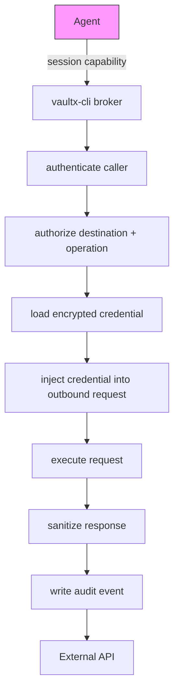
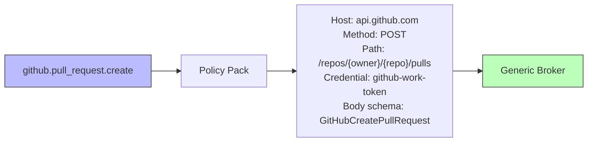
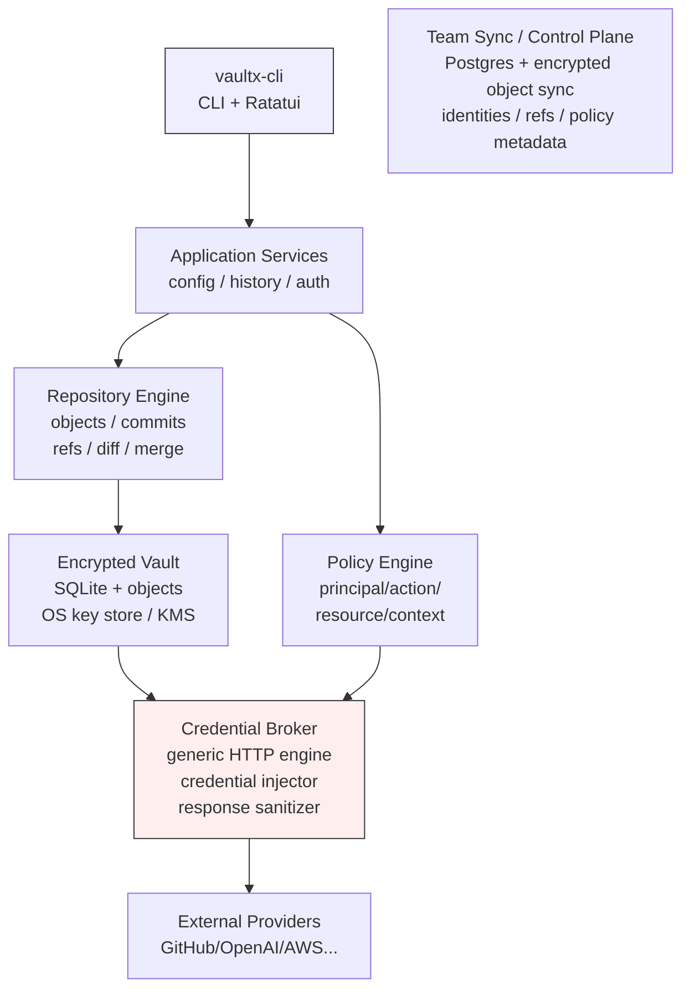
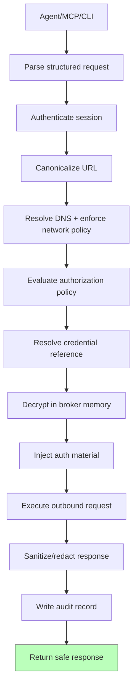
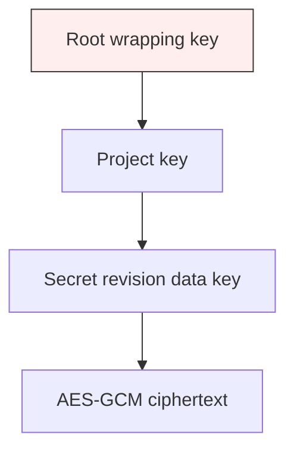
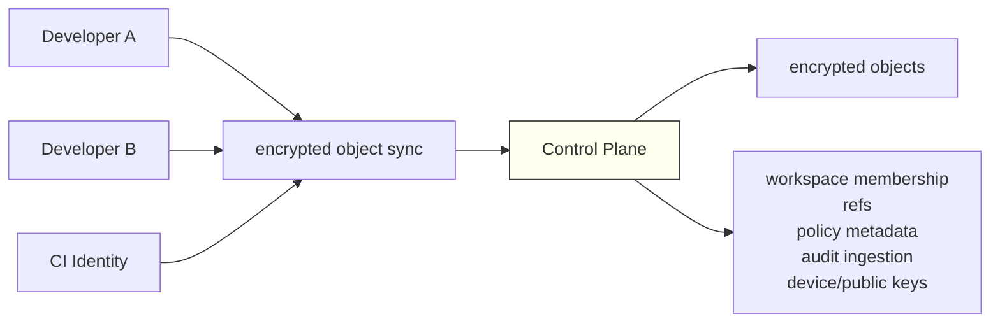
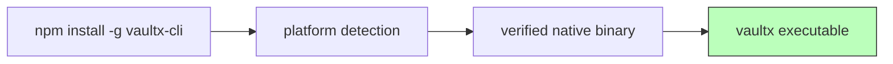

# vaultx-cli

> **Terminal-native secret management, Git-style configuration history, and a secretless credential broker for AI agents.**

`vaultx-cli` is a Rust-native CLI/TUI for managing configuration and secrets while allowing AI agents to use protected credentials without receiving the raw credential values.

It combines four capabilities in one terminal-first product:

- **Encrypted secrets and configuration management** for local development, CI, workloads, and teams.
- **Git-style configuration history** with staging, commits, diffs, branches, merges, rollback, signatures, and protected environments.
- **A LazyGit-inspired TUI** for interactive workflows without requiring a web dashboard.
- **A provider-neutral credential broker** that executes policy-approved outbound requests and injects credentials outside the agent process.

The security model is built around one invariant:

> **An agent can be authorized to use a credential without being authorized to read the credential.**

---

## Why vaultx-cli exists

The common developer workflow still spreads configuration and secrets across:

- `.env` files.
- shell profiles.
- CI secret stores.
- deployment platform variables.
- password managers.
- team chat.
- local agent environments.
- IDE and coding-agent processes.

That creates three separate problems.

### Configuration drift

Development, staging, production, and ephemeral environments often diverge without a clear, reviewable history.

### Secret sprawl

A secret is copied into multiple systems and becomes difficult to rotate, audit, or destroy consistently.

### Agent credential exposure

Coding agents commonly inherit the developer shell environment. If that shell contains:

```text
GITHUB_TOKEN=ghp_...
OPENAI_API_KEY=sk-...
AWS_SECRET_ACCESS_KEY=...
```

then the agent process can potentially print, log, transmit, or misuse those values.

Prompt instructions such as "never print environment variables" are not a security boundary.

`vaultx-cli` changes that model:



The agent receives the result of the approved request, not the upstream secret.

---

# Product definition

`vaultx-cli` is not intended to become a catalog of thousands of hard-coded provider actions.

The broker is **provider-neutral by default**.

Its core authorization model operates on:

- destination host.
- scheme and port.
- HTTP method.
- path pattern.
- query parameters.
- request headers.
- request body constraints.
- response filters.
- credential binding.
- agent identity.
- project and environment.
- request limits and budgets.

Optional semantic policy packs provide names such as:

```text
github.pull_request.create
github.repository.read
openai.responses.create
```

but these names compile into the generic broker policy model.

This means `vaultx-cli` does **not** require a custom Rust adapter for every API endpoint.

Example:



Semantic packs improve ergonomics. The generic broker remains the security primitive.

---

# User experience

## Installation

Primary npm distribution:

```bash
npm install -g vaultx-cli
```

The npm package installs the correct native Rust binary for the platform.

Native distribution can also expose the same binary through supported Rust/system package channels.

The executable name is:

```bash
vaultx
```

---

## Launch the TUI

```bash
vaultx
```

Running `vaultx` without a subcommand opens the terminal UI.

```text
┌─ vaultx-cli ─ acme/backend ───────────── development ─ main ─ * clean ┐
│                                                                       │
├─ Environments ─────┬─ Variables ──────────────────┬─ History ─────────┤
│                    │                               │                    │
│ > development      │ NAME                 TYPE     │ * 71ad92f          │
│   staging          │───────────────────────────────│   rotate db secret │
│   production !     │ API_URL              config   │                    │
│                    │ DATABASE_URL         secret * │ * f32ac11          │
│ Branches           │ GITHUB_TOKEN       brokered + │   agent policy     │
│                    │ OPENAI_API_KEY     brokered + │                    │
│ > main             │ LOG_LEVEL            config   │ * 991ab02          │
│   feature/auth     │                               │   initial config   │
├────────────────────┴───────────────────────┴────────────────────────────┤
│ Selected: GITHUB_TOKEN                                                  │
│                                                                         │
│ Type          Brokered credential                                       │
│ Value         NEVER EXPOSED                                             │
│ Credential    github-work-token                                         │
│ Environment   development                                               │
├─ Agent Policy ───────────────────────────────────────────────────────────┤
│ coding-agent                                                            │
│ + api.github.com  GET  /repos/acme/backend/*                            │
│ + api.github.com  POST /repos/acme/backend/pulls                        │
│ - api.github.com  DELETE *                                              │
│ - secrets.read                                                           │
├──────────────────────────────────────────────────────────────────────────┤
│ 1 Env  2 Vars  3 History  4 Agents  5 Audit │ a Add │ c Commit │ ? Help │
└──────────────────────────────────────────────────────────────────────────┘
```

Markers in the mockup: `*` commit/change indicator, `+` brokered credential,
`!` protected environment, `+`/`-` allowed/denied agent policy rule.

### Navigation

| Key | Action |
|---|---|
| `1` | Environments |
| `2` | Variables |
| `3` | History |
| `4` | Agents |
| `5` | Audit |
| `h/l` | Change pane |
| `j/k` | Move selection |
| `Enter` | Inspect selected item |
| `a` | Add/create |
| `e` | Edit |
| `c` | Commit |
| `d` | Diff |
| `b` | Branch |
| `m` | Merge |
| `r` | Restore/rollback |
| `p` | Policy editor |
| `/` | Search/filter |
| `?` | Context keybindings |
| `q` | Close current view/exit |

The bottom action bar is context-sensitive so the interface remains discoverable without sacrificing keyboard speed.

---

# CLI surface

The TUI and CLI call the same Rust application services. Nothing important exists only in the UI.

## Repository

```bash
vaultx init
vaultx status
vaultx doctor
```

## Configuration

```bash
vaultx set API_URL=https://api.example.com
vaultx get API_URL
vaultx unset API_URL
vaultx list
vaultx import .env
```

## Secrets

```bash
vaultx secret set DATABASE_URL
vaultx secret set GITHUB_TOKEN --brokered
vaultx secret metadata GITHUB_TOKEN
vaultx secret rotate DATABASE_URL
vaultx secret destroy DATABASE_URL --revision <revision-id>
```

Secret values are accepted through a protected prompt or stdin by default.

Avoid putting secret material directly in command arguments.

## Version control

```bash
vaultx add API_URL
vaultx add --all
vaultx restore API_URL
vaultx commit -m "configure application"
vaultx log
vaultx show <commit-id>
vaultx diff
vaultx diff development production
vaultx branch feature/auth
vaultx checkout feature/auth
vaultx merge main
vaultx rollback <commit-id>
```

## Environment promotion

Branches and deployment environments are separate concepts.

```bash
vaultx env create staging
vaultx env protect production
vaultx promote main --to staging
vaultx promote staging --to production
```

A branch represents configuration history. An environment represents a deployment/configuration target with policy.

## Trusted workload execution

Applications that are explicitly permitted to receive secret values can run through:

```bash
vaultx run -- npm run dev
vaultx run -- cargo run
vaultx run -- python app.py
```

`vaultx run` constructs the child environment in memory. It does not create a temporary plaintext `.env` file.

## Agent execution

```bash
vaultx agent create coding-agent
vaultx agent inspect coding-agent
vaultx agent policy edit coding-agent
vaultx agent run coding-agent -- claude
vaultx agent run coding-agent -- codex
vaultx agent revoke coding-agent
```

The agent child process receives:

```text
VAULTX_AGENT_ID
VAULTX_SESSION_TOKEN
VAULTX_BROKER_ENDPOINT
```

and explicitly allowed non-sensitive configuration.

It does not receive brokered secret values.

## Broker requests

Low-level broker access:

```bash
vaultx broker request \
  --credential github-work-token \
  --method GET \
  --url https://api.github.com/repos/acme/backend/issues
```

Agents should normally invoke the broker through a local tool interface rather than constructing shell commands.

## MCP interface

`vaultx-cli` can expose the broker as an MCP server:

```bash
vaultx mcp serve --agent coding-agent
```

Core MCP tools:

```text
vaultx.list_capabilities
vaultx.http_request
vaultx.config_get
vaultx.audit_context
```

`vaultx.http_request` accepts a structured request and routes it through the same policy engine as the CLI broker command.

The MCP server never exposes a tool equivalent to:

```text
vaultx.secret_get
```

for brokered credentials.

## Audit

```bash
vaultx audit
vaultx audit --agent coding-agent
vaultx audit --decision deny
vaultx audit export --format json
```

## Team synchronization

```bash
vaultx login
vaultx workspace create acme
vaultx remote add origin <workspace>
vaultx push
vaultx pull
vaultx sync
```

Synchronization transfers encrypted objects, signed metadata, refs, policies, and authorized team state. The sync service does not require plaintext secret storage when client-controlled encryption mode is enabled.

---

# Variable classes

`vaultx-cli` distinguishes data according to exposure semantics.

| Type | Human CLI/TUI value access | Trusted app | Agent | Storage |
|---|---:|---:|---:|---|
| `config` | Yes | Yes | Policy-controlled | Versioned plaintext |
| `secret` | Authorized only | Yes | No by default | Encrypted |
| `brokered` | Controlled administrative reveal only | Broker-oriented | Never | Encrypted |
| `dynamic` | Controlled | Lease-dependent | Broker-oriented | Generated/leased |

## `config`

Examples:

```text
API_URL
LOG_LEVEL
NODE_ENV
FEATURE_FLAG_X
```

Config values can appear in diffs and manifests.

## `secret`

Examples:

```text
DATABASE_URL
JWT_SIGNING_SECRET
SMTP_PASSWORD
```

A trusted workload can receive the plaintext if policy allows it.

## `brokered`

Examples:

```text
GITHUB_TOKEN
OPENAI_API_KEY
STRIPE_SECRET_KEY
CLOUD_API_TOKEN
```

A brokered value is intended for credential injection. Agent workflows reference the credential by logical name.

## `dynamic`

Examples include dynamically created cloud/database credentials or provider-issued scoped tokens. Dynamic credential providers implement a lease interface while preserving the same agent-facing broker model.

---

# Architecture



---

# Trust boundaries

## TUI/CLI process

Responsible for:

- input handling.
- repository operations.
- user interaction.
- policy editing.
- launching trusted workloads.
- initiating agent sessions.

It is not the agent secret boundary.

## Vault

Responsible for:

- encrypted secret revisions.
- key wrapping metadata.
- secret classification.
- secret destruction state.
- content-addressed objects.

## Broker

Responsible for:

- caller authentication.
- policy authorization.
- destination validation.
- credential resolution.
- credential injection.
- outbound transport.
- response sanitization.
- audit generation.

The broker is a separate process/service from the agent.

## Agent

The agent is treated as potentially prompt-injected or compromised.

The agent cannot be trusted to enforce its own credential restrictions.

---

# Broker architecture

The broker is the primary differentiated subsystem in `vaultx-cli`.

## Generic request model

```rust
pub struct BrokerRequest {
    pub session_id: SessionId,
    pub credential: CredentialRef,
    pub method: HttpMethod,
    pub destination: Url,
    pub headers: SafeHeaderMap,
    pub query: QueryMap,
    pub body: BrokerBody,
    pub capability_hint: Option<CapabilityName>,
}
```

Authorization evaluates the fully resolved request, not merely `capability_hint`.

A semantic capability therefore cannot bypass low-level host/path/method checks.

## Request pipeline



## Credential injection templates

The generic broker supports reusable injection modes:

```text
Authorization: Bearer <secret>
Authorization: token <secret>
X-API-Key: <secret>
Basic <username:secret>
query_parameter=<secret>
custom_header=<secret>
request_template field injection
```

Policies bind a credential to a permitted injection template. The agent cannot choose arbitrary secret placement.

## Network restrictions

The broker must defend against credential exfiltration through request redirection or network confusion.

Required controls include:

- HTTPS enforcement unless explicitly configured otherwise.
- hostname allowlists.
- port restrictions.
- redirect policy.
- DNS rebinding defenses.
- private/link-local/loopback network blocking unless explicitly allowed.
- canonical host validation.
- credential stripping across unauthorized redirects.
- response size limits.
- request size limits.
- header allow/deny rules.

## Policy example

```yaml
principal: agent:coding-agent
credential: github-work-token

allow:
  host: api.github.com
  methods: [GET, POST]
  paths:
    - /repos/acme/backend
    - /repos/acme/backend/issues/**
    - /repos/acme/backend/pulls

request:
  deny_headers:
    - Authorization
    - Proxy-Authorization
  max_body_bytes: 262144

response:
  max_body_bytes: 1048576
  redact_headers:
    - set-cookie

deny:
  methods: [DELETE, PATCH]
  paths:
    - /user/**
    - /orgs/**/settings/**
```

The agent supplies the desired request. The broker supplies the credential only if the complete request satisfies policy.

---

# Semantic policy packs

Provider-specific integrations are declarative policy/schema packages rather than mandatory hard-coded transport adapters.

Example pack:

```yaml
name: github.pull_request.create
provider: github

request:
  host: api.github.com
  method: POST
  path: /repos/{owner}/{repo}/pulls
  body_schema: github.create_pull_request.v1

credential:
  injection: github_bearer

constraints:
  owner:
    allow: [acme]
  repo:
    allow: [backend]
```

The pack compiles to generic broker constraints.

This provides:

- human-readable capabilities.
- provider-aware validation.
- reusable defaults.
- better audit labels.
- no requirement to implement each endpoint as Rust code.

A provider-specific Rust module is justified only when an API cannot be represented safely through the generic broker model, such as custom signing protocols or non-HTTP transports.

---

# Agent capability model

An agent receives a scoped session capability rather than the provider token.

Conceptual claims:

```json
{
  "subject": "agent:coding-agent",
  "project": "acme/backend",
  "environment": "development",
  "policy_set": "coding-agent-default",
  "session": "sess_...",
  "nonce": "..."
}
```

The session credential proves access to the vaultx-cli broker. It is not useful directly against GitHub, OpenAI, AWS, or another upstream service.

## Sub-agent delegation

Delegation follows attenuation:

```text
Child permissions ⊆ Parent permissions
```

A parent agent can delegate only capabilities it already possesses and can narrow:

- hosts.
- paths.
- methods.
- environments.
- credentials.
- request limits.
- allowed operations.

The child cannot widen its authority.

---

# Version-control model

The configuration store uses a Git-inspired content-addressed graph without storing plaintext secrets as repository objects.

## Core objects

```text
Blob/ConfigObject
SecretRevisionRef
Manifest
PolicyObject
Commit
Ref
Signature
```

## Commit object

Conceptual representation:

```json
{
  "type": "commit",
  "format": 1,
  "parents": ["sha256:..."],
  "manifest": "sha256:...",
  "author": "identity:...",
  "message": "configure GitHub broker policy",
  "signature": "ed25519:..."
}
```

Commit IDs are derived from canonical serialized content.

## Secret revisions

A manifest references secret revision metadata:

```json
{
  "name": "GITHUB_TOKEN",
  "kind": "brokered",
  "revision": "sec_rev_01...",
  "fingerprint": "hmac-sha256:..."
}
```

Diff output shows:

```diff
 GITHUB_TOKEN
- brokered revision sec_rev_A
+ brokered revision sec_rev_B
```

It does not show plaintext.

## Branches and environments

Branches represent change history.

Environments represent protected targets.

Promotion explicitly updates an environment ref under its authorization policy.

---

# Cryptographic design

`vaultx-cli` uses established cryptographic primitives and does not define custom algorithms.

## Secret encryption

Recommended primitive:

```text
AES-256-GCM
```

Each encrypted secret revision uses a unique nonce and authenticated metadata.

## Envelope hierarchy



Local root material is stored through the native OS secure credential facility where available.

Team/managed deployment can bind wrapping operations to an external KMS/HSM provider.

## Signatures

Use Ed25519 for:

- commit signatures.
- device identities.
- signed capability/session artifacts where appropriate.

## Secret fingerprints

Do not store a raw `SHA256(secret)` fingerprint.

Use keyed fingerprints such as:

```text
HMAC-SHA256(project_fingerprint_key, secret)
```

This enables equality/change checks without exposing a direct unsalted verifier.

## Secret memory handling

Secret-bearing Rust types should:

- avoid `Debug` output.
- avoid accidental serialization.
- zero memory where practical through `zeroize`.
- minimize clones.
- expose narrow accessors.
- redact error paths.

---

# Crypto-shredding

Version history and secret recoverability are separate concepts.

A secret revision can remain referenced in historical metadata while its decryption key is destroyed.

The history can then show:

```text
DATABASE_URL
revision: sec_rev_...
state: cryptographically destroyed
```

without preserving decryptable secret material.

---

# Local repository layout

```text
project/
├── .git/
├── .vaultx/
│   ├── HEAD
│   ├── config.toml
│   ├── index.db
│   ├── objects/
│   │   └── sha256/
│   ├── refs/
│   │   ├── heads/
│   │   └── environments/
│   ├── policies/
│   └── runtime/
├── src/
└── ...
```

Rules:

- plaintext secrets never live in `.vaultx/objects`.
- object IDs are content-addressed.
- local indexes are rebuildable from canonical objects.
- broker runtime sockets/tokens are not committed.
- secret decryption keys are not repository objects.

---

# Team sync model

The team service synchronizes project state while keeping cryptographic boundaries explicit.



Server responsibilities:

- workspace identity and membership.
- project discovery.
- encrypted object storage.
- ref synchronization.
- policy distribution.
- device/public-key registration.
- audit storage.
- conflict detection.

Client-controlled encryption mode keeps secret plaintext and project unwrapping material outside the sync service.

---

# TUI screens

The TUI is a first-class interface rather than a thin command menu.

Required screens:

### Dashboard

- environment selection.
- variable list.
- history.
- change status.
- selected-item inspector.

### Diff

- config value additions/removals/changes.
- secret revision metadata changes.
- policy changes.
- staged/unstaged sections.

### Commit

- staged changes.
- commit message.
- signer identity.
- signature state.

### Agents

- identities.
- active sessions.
- policy set.
- credentials usable through broker.
- denied/allowed scopes.

### Policy editor

- host rules.
- method rules.
- path rules.
- credential binding.
- body/schema constraints.
- network rules.
- semantic pack attachment.

### Audit

- actor/agent.
- decision.
- capability label.
- destination.
- credential logical name.
- request metadata.
- policy rule identifier.
- correlation ID.

### Environments

- environment refs.
- protection rules.
- promotion diff.
- approvals where configured.

### Sync

- remote state.
- incoming/outgoing object changes.
- conflicts.
- device signatures.

---

# Rust workspace

```text
vaultx-cli/
├── Cargo.toml
├── rust-toolchain.toml
├── README.md
├── PLAN.md
├── SECURITY.md
├── deny.toml
│
├── crates/
│   ├── vaultx-cli/              # Clap command surface
│   ├── vaultx-tui/              # Ratatui application
│   ├── vaultx-core/             # application services/domain
│   ├── vaultx-types/            # shared IDs and API types
│   ├── vaultx-repository/       # objects, refs, commits, diff, merge
│   ├── vaultx-crypto/           # AEAD, signatures, fingerprints
│   ├── vaultx-keyring/          # platform secure-key integration
│   ├── vaultx-policy/           # policy model + Cedar integration
│   ├── vaultx-broker/           # broker service
│   ├── vaultx-broker-client/    # IPC/remote client
│   ├── vaultx-http/             # hardened outbound HTTP engine
│   ├── vaultx-policy-packs/     # semantic provider policy packs
│   ├── vaultx-audit/            # append-only audit abstraction
│   ├── vaultx-sync-client/      # team sync protocol
│   ├── vaultx-control-plane/    # remote service
│   ├── vaultx-mcp/              # MCP server/tool bridge
│   └── vaultx-testkit/          # security/integration fixtures
│
├── packages/
│   ├── vaultx-cli/              # npm native-binary installer
│   └── agent-sdk/               # optional TypeScript client
│
└── policy-packs/
    ├── github/
    ├── openai/
    ├── stripe/
    └── generic/
```

---

# Technology stack

| Concern | Choice |
|---|---|
| Language | Rust |
| Async runtime | Tokio |
| CLI | Clap |
| TUI | Ratatui |
| Terminal backend | Crossterm |
| HTTP server | Axum |
| HTTP client | Reqwest + rustls |
| Serialization | Serde |
| Canonical object encoding | deterministic CBOR or explicitly canonicalized JSON |
| Local index | SQLite via SQLx |
| Remote database | PostgreSQL via SQLx |
| Encryption | AES-256-GCM |
| Signatures | Ed25519 |
| Secret memory hygiene | zeroize + secret wrapper types |
| Local secure key storage | platform keyring APIs |
| Authorization | Cedar behind an internal authorization trait |
| IPC | Unix domain sockets / Windows named pipes |
| Remote transport | HTTPS/mTLS where applicable |
| DNS/network enforcement | broker-owned resolver/connection validation |
| MCP | Rust MCP server implementation |
| npm distribution | JS launcher + platform-native Rust binaries |
| Supply-chain checks | cargo-deny, cargo-audit, locked dependencies |
| Property testing | proptest |
| Fuzzing | cargo-fuzz/libFuzzer |

---

# Data storage

## Local SQLite

Use SQLite for indexes and query-oriented state:

```text
variables
secret_revisions
refs
staging_entries
agents
agent_sessions
policies
policy_bindings
audit_events
remotes
sync_state
```

Canonical content-addressed objects remain separately stored under `.vaultx/objects`.

## Remote PostgreSQL

Core tables:

```text
users
workspaces
workspace_members
projects
devices
objects
refs
environments
policies
policy_bindings
agent_identities
agent_sessions
audit_events
sync_cursors
```

Secret ciphertext may be stored as encrypted object payloads. Plaintext is never an ordinary database column.

---

# Authorization model

Authorization requests use four core dimensions:

```text
principal
operation
resource
context
```

Example:

```text
principal = Agent::"coding-agent"
operation = Action::"http.request"
resource  = Credential::"github-work-token"
context   = {
  host: "api.github.com",
  method: "POST",
  path: "/repos/acme/backend/pulls",
  environment: "development"
}
```

Default result is deny.

Cedar policies can represent the decision model while the broker additionally enforces non-policy transport invariants such as DNS, redirect, TLS, and header safety.

---

# Security invariants

The implementation must preserve all of the following:

1. Plaintext secret values are never content-addressed repository objects.
2. Brokered credentials are never injected into an agent child environment.
3. Brokered credentials are never returned by the agent API/MCP interface.
4. Authorization uses the canonical resolved destination.
5. An agent cannot set or override credential-injection headers.
6. Unauthorized redirects never carry credentials.
7. Private-network access is denied unless explicitly configured.
8. Policy defaults to deny.
9. Child-agent delegation cannot exceed parent authority.
10. Secret values never appear in normal logs, diffs, audit payloads, panic messages, or error displays.
11. Secret revisions can be cryptographically destroyed independently of commit metadata.
12. Commit/object signatures are verified when trust crosses device or remote boundaries.
13. TUI and CLI invoke the same domain operations.
14. The generic broker remains functional without provider-specific code.
15. Semantic policy packs can only narrow or describe broker behavior; they cannot bypass broker invariants.

---

# Testing requirements

## Unit tests

- canonical serialization.
- object hashing.
- staging behavior.
- diff behavior.
- branch/ref operations.
- policy matching.
- URL canonicalization.
- secret wrapper redaction.
- key wrapping/unwrapping.

## Property tests

- serialize/deserialize stability.
- merge invariants.
- canonical URL equivalence.
- child capabilities never widen parent authority.
- denied request transformations remain denied.

## Integration tests

- local vault lifecycle.
- secret set/read through trusted workload path.
- agent broker request without secret exposure.
- Unix socket / named-pipe authentication.
- sync between multiple clients.
- protected environment promotion.
- MCP tool invocation.
- policy pack compilation.

## Security tests

- SSRF attempts.
- DNS rebinding scenarios.
- redirect credential leakage.
- malicious `Host` headers.
- user-supplied `Authorization` headers.
- response header secret reflection.
- command/environment leakage.
- path canonicalization bypasses.
- oversized body handling.
- malformed chunked responses.
- policy-confusion attacks.
- repository object tampering.
- corrupted ciphertext/tag handling.

## Fuzz targets

- broker request parser.
- policy pack parser/compiler.
- repository object decoder.
- manifest decoder.
- URL/path canonicalizer.
- diff/merge inputs.

---

# Packaging

The npm package is a launcher/distribution package, not the security implementation.



Platform artifacts should be checksummed and signed. The installer verifies the artifact metadata it consumes.

---

# Scope

A complete `vaultx-cli` implementation includes all of these subsystems as one coherent product:

- CLI.
- LazyGit-style TUI.
- local repository.
- config import and management.
- encrypted secret vault.
- key hierarchy and local secure-key storage.
- Git-style commits/diffs/branches/merge/rollback.
- signed object history.
- protected environments and promotion.
- trusted workload execution.
- provider-neutral credential broker.
- agent identities and sessions.
- Cedar-backed policy authorization.
- hardened outbound HTTP engine.
- declarative semantic policy packs.
- MCP broker interface.
- append-only audit model.
- sub-agent capability attenuation.
- team workspace synchronization.
- remote control plane.
- strict isolated/remote broker deployment.
- dynamic credential provider interface.
- npm native-binary distribution.
- complete security and integration test suite.

---

# Design statement

`vaultx-cli` is best understood as:

> **LazyGit for configuration and secrets, combined with a credential firewall for AI agents.**

Its differentiator is not that it stores API keys. Existing secret managers already do that well.

Its differentiator is that the same terminal workflow manages:

```text
configuration history
        +
encrypted secret state
        +
agent authority
        +
credential-backed network execution
        +
auditability
```

while preserving the core guarantee:

> **Agents operate with capabilities. Credentials remain inside the trusted broker boundary.**
